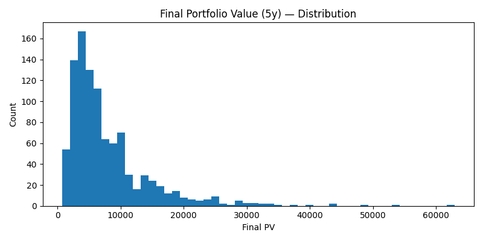

# Project 3: Portfolio Optimisation & Forecasting Engine
## Motivation
This project grew out of my curiosity about applying quantitative methods and AI skills to finance. I wanted to test how optimisation, rebalancing, and forecasting actually affect portfolios when applied to real market data.
It was also a way to explore potential career directions — from data science to quantitative finance — while reinforcing my understanding of portfolio theory, time-series forecasting, and risk management.
By building this system, I aimed to:
- Experiment with different rebalancing strategies and see their impact on growth, volatility, and costs.
- Apply machine learning (XGBoost) to predict returns and evaluate its limitations in a noisy financial domain.
- Develop an interactive dashboard that makes these ideas accessible for hands-on exploration.

--- 

## Overview
This project is an end-to-end portfolio optimisation and risk management engine with an additional return forecasting module.
It combines:
- Data collection from Yahoo Finance (`yfinance`)
- Exploratory data analysis (EDA) of returns, volatility, and correlations
- Portfolio optimisation using Max Sharpe ratio with constraints
- Rebalancing simulations (periodic + threshold-based)
- Monte Carlo simulations for forward-looking risk modelling
- XGBoost forecasting for daily returns
- Streamlit dashboard for interactive experimentation
The goal is to explore how different portfolio construction and rebalancing strategies affect performance, stability, and risk.

---

## Data
- **Universe:** KO, JNJ, MSFT, TSLA, NVDA, XOM, SPY, SHY  
- **Period:** 2020-01-01 to 2025-01-01  
- **Source:** [Yahoo Finance](https://finance.yahoo.com/) via `yfinance`

---

## Methods
### 1. Exploratory Data Analysis
  - Computed daily returns, volatility, Sharpe ratios, skewness, kurtosis.
  - Visualised stock price trends, return distributions, and correlation heatmaps.
  - Observed that NVDA/TSLA drive high returns but with extreme volatility; KO/JNJ provide stability; SHY acts as a defensive anchor.

### 2. Portfolio Optimisation
  - Objective: **Maximise Sharpe ratio**  (risk-adjusted returns)
  - Constraints:
    - Weights sum to 1
    - Long-only (no short selling)
    - ≤ 20% allocation per asset
    - ≥ 5% allocation to SHY for defensiveness

### 3. Rebalancing Strategies
Custom `simulate_rebalance` function tested:
  - Buy & Hold (no rebalance)
  - Periodic (monthly, quarterly, yearly)
  - Threshold-based (rebalance if any weight drifts >5%)
    
Tracked: portfolio value, turnover, rebalancing costs, CAGR, Sharpe, volatility, and drawdowns.

### 4. Monte Carlo Simulation
  - Returns modelled using Geometric Brownian Motion (GBM).
  - Simulated 1,000 portfolio paths over 5 years.
  - Analysed distributions of final portfolio value, Sharpe ratios, and drawdowns.

### 5. Forecasting Module (XGBoost)
#### XGBoost Return Prediction Workflow
- Features: Lagged returns, rolling averages/volatility, momentum, cross-sectional market return, day-of-week, one-hot encoded tickers.
- Target: Next-day return per ticker.
- Splits: Train (2020–2022), Validation (2023), Test (2024).
- Model: XGBRegressor with hyperparameter tuning via GridSearchCV + early stopping.
- Evaluation: RMSE, MAE, R², Hit ratio (≈0.53), IC (≈0.04).
- Findings: Model struggled with magnitude (reverting to mean) but showed modest directional skill.

---

## Results
### Key Insights
  - Yearly rebalancing gave the highest Sharpe (~1.7) and CAGR while keeping turnover manageable.
  - Threshold rebalancing (5%) struck a balance: lower costs, still competitive performance.
  - Buy & Hold produced strong growth but extreme drawdowns.
  - Monte Carlo highlighted tail risk: some scenarios had >-35% drawdowns.
  - Forecasting showed the challenge of predicting noisy returns, but feature engineering + XGBoost provided some signal above chance.

### Example Outputs
#### Efficient Frontier  
  

#### Risk vs Return  
  

#### Monte Carlo Simulation  
  

#### True vs Predicted Returns (Test Set)  
  

#### Streamlit Dashboard  


---

## usage
### 1. Clone & Install  
Clone the repository and install the requirements:
```bash
git clone https://github.com/Chisomikec/Project-3_Portfolio_Engine.git
cd Project-3_Portfolio_Engine
pip install -r requirements.txt
```
### 2. Run the Streamlit Dashboard  

```bash
streamlit run app.py
```
#### Features:
  - Select assets (≥5 required).
  - Choose date range, rebalancing method, and parameters.
  - Run optimisation, view portfolio weights, equity curve, and performance metrics.

### 3. Run the Forecasting Notebook
  - Open `predict.ipynb` (XGBoost forecasting).
  - Trains & evaluates the return prediction model with engineered features.
  - Saves outputs to `/artifacts` (final model, predictions, plots).

### 4. View Outputs
  - Figures (efficient frontier, Sharpe/volatility distributions, Monte Carlo results, etc.) are stored in `/figure`.
  - Model artifacts & predictions are stored in `/artifacts`.
    
---

## What I Learned 
  - Reinforced how portfolio optimisation theory (Sharpe ratio, constraints) translates into code.
  - Saw the trade-offs between rebalancing frequency, turnover, and performance.
  - Understood the limits of machine learning in noisy financial data — feature engineering matters, but predictions tend to regress toward the mean.
  - Learned to package analysis into a usable dashboard that makes the system interactive.
